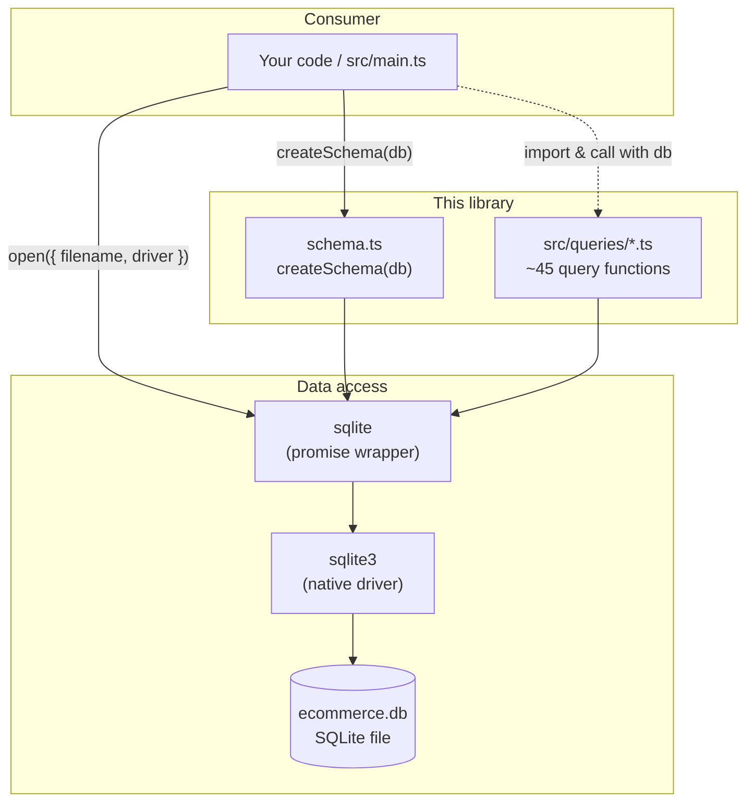
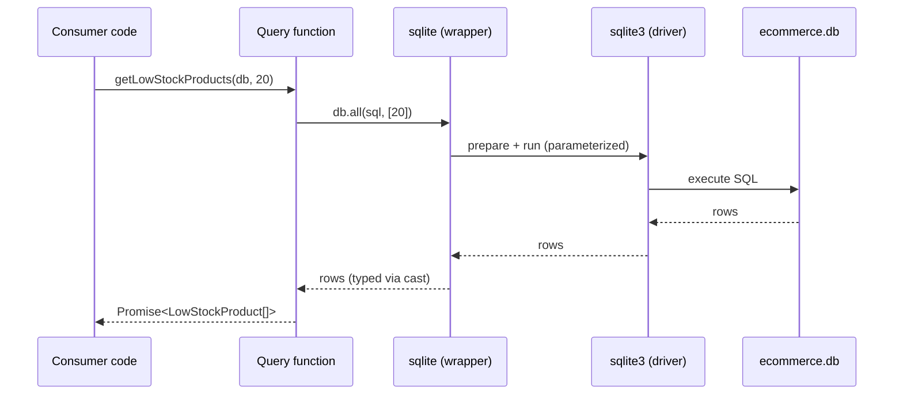
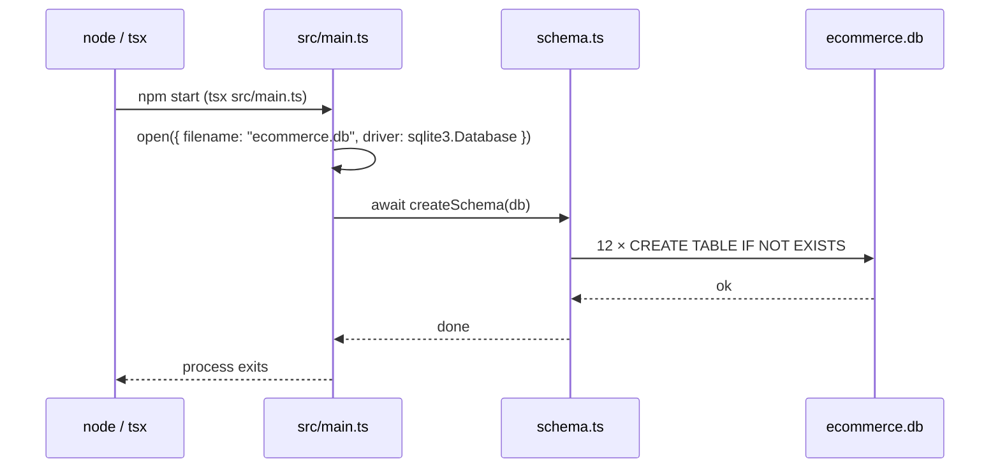
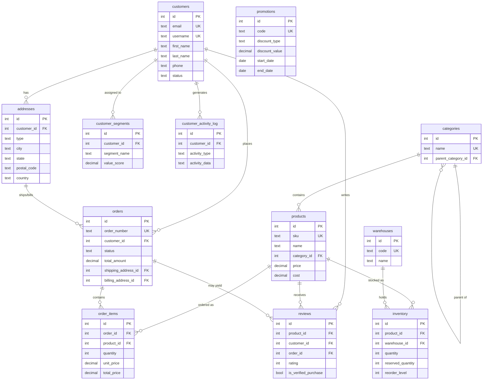

# E-commerce Query Utils

A **TypeScript library of read-only SQLite query functions** for an e-commerce data model. It packages a relational schema (`createSchema`) and a catalogue of ~45 typed, parameterized SQL queries spanning customers, products, orders, inventory, reviews, promotions, shipping, and analytics.

It is a **data-access / utilities layer** — not a web server. There is no HTTP API, no router, no authentication middleware, and no background worker. The "API" is the set of exported TypeScript functions you import and call with a `Database` connection.

---

## Table of Contents

- [Project Overview](#project-overview)
- [Architecture](#architecture)
- [Folder Structure](#folder-structure)
- [Technology Stack](#technology-stack)
- [Installation Guide](#installation-guide)
- [Environment Variables](#environment-variables)
- [Project Workflow](#project-workflow)
- [API Documentation (Query Functions)](#api-documentation-query-functions)
- [Database](#database)
- [Build & Deployment](#build--deployment)
- [Available Scripts](#available-scripts)
- [Testing](#testing)
- [Troubleshooting](#troubleshooting)
- [Design Decisions](#design-decisions)
- [Known Limitations](#known-limitations)
- [Future Improvements](#future-improvements)
- [Contributing](#contributing)
- [License](#license)

---

## Project Overview

### Purpose
Provide a clean, reusable, strongly-typed set of SQL helper functions for an e-commerce SQLite database, so application code can answer common business questions (e.g. "which products are low on stock?", "who are my repeat customers?", "which orders are still pending?") without re-writing SQL.

### Problem it solves
E-commerce reporting and operational queries are repetitive, easy to get wrong, and prone to SQL injection when assembled ad hoc. This project centralizes those queries in one place where they are:
- **Parameterized** (safe against SQL injection),
- **Typed** (result shapes described by TypeScript interfaces),
- **Dependency-injected** (every function takes the `Database` handle as its first argument, making it trivial to test and to point at any SQLite connection),
- **Organized by domain** (one module per concern under `src/queries/`).

### Key features
- 🗄️ **Schema bootstrapping** — `createSchema(db)` creates 12 related tables idempotently (`CREATE TABLE IF NOT EXISTS`).
- 🔎 **~45 query functions** across 8 domain modules.
- 🛡️ **Parameterized SQL** throughout — no string-concatenated user input.
- 🧩 **Promise-based API** via the `sqlite` wrapper (`db.get` / `db.all`).
- 🧪 **Type-safe** — `strict` TypeScript, executed directly with `tsx` (no build step required for development).
- 🤖 **Claude Code tooling** — repository ships with example hooks (type-check gate, query-duplication reviewer) and an Agent SDK demo.

---

## Architecture

This is a layered library. Consumer code obtains a `Database` connection and passes it into pure query functions.



### Module responsibilities
Every query module is a **leaf module**: it imports only the `Database` type from `sqlite`, never another query module, and is never imported by another query module. There is no shared mutable state and no connection singleton — the `Database` is always passed in.

### Request lifecycle (a single query call)



### Startup / system workflow (the bundled entry point)



> Note: `src/main.ts` only creates the schema. It does **not** invoke any query functions — the query modules are a library intended for import by consumer code.

---

## Folder Structure

```
.
├── src/
│   ├── main.ts                 # Entry point: opens ecommerce.db and runs createSchema
│   ├── schema.ts               # createSchema(db) — defines & creates 12 tables
│   └── queries/                # All database queries live here (one module per domain)
│       ├── customer_queries.ts     # Customer lookups, segments, profiles, search
│       ├── product_queries.ts      # Catalog, stock levels, SKU lookup, reorder
│       ├── order_queries.ts        # Order details, status, recent/high-value orders
│       ├── analytics_queries.ts    # CLV, sales-by-category, repeat customers, trends
│       ├── inventory_queries.ts    # Warehouse stock, availability, transfers, movements
│       ├── promotion_queries.ts    # Active/expiring promos, eligibility, performance
│       ├── review_queries.ts       # Product/customer reviews, ratings, verification
│       └── shipping_queries.ts     # Shipping addresses, destinations, delays
├── hooks/                      # Claude Code hooks (dev tooling — NOT app runtime)
│   ├── query_hook.js               # PreToolUse: duplicate-query reviewer (currently dormant)
│   ├── read_hook.js                # PreToolUse: blocks reading .env (not wired in by default)
│   └── tsc.js                      # PostToolUse: TypeScript type-check gate
├── scripts/
│   └── init-claude.js          # `npm run setup`: generates .claude/settings.local.json
├── .claude/
│   └── settings.example.json   # Hook configuration template ($PWD placeholders)
├── sdk.ts                      # Demo: drives @anthropic-ai/claude-agent-sdk (`npm run sdk`)
├── tsconfig.json               # Strict TS, ES2022, ESM, outDir ./dist
├── package.json                # Scripts & dependencies
├── .env.example                # Documents required env vars (copy to .env)
├── CLAUDE.md                   # Guidance for Claude Code in this repo
├── task.md                     # Original feature brief (historical context)
└── README.md
```

> **Critical convention:** *all database queries must live in `src/queries/`.* This is enforced/encouraged by the `hooks/query_hook.js` Claude Code hook and stated in `CLAUDE.md`.

---

## Technology Stack

| Layer | Technology | Version | Purpose |
|---|---|---|---|
| Language | **TypeScript** | ^5.8 | Strongly-typed source (`strict: true`) |
| Runtime | **Node.js** | ≥ 18 (tested on 22) | JavaScript runtime (ESM) |
| TS execution | **tsx** | ^4.20 | Run `.ts` directly without a build step |
| Database | **SQLite** | via `sqlite3` ^5.1 | Embedded relational database |
| DB wrapper | **sqlite** | ^5.1 | Promise-based API over `sqlite3` (`db.get`/`db.all`/`db.exec`) |
| Types | **@types/node** | ^24 | Node type definitions |
| Dev demo | **@anthropic-ai/claude-agent-sdk** | ^0.1.5 | Agent SDK demo (`sdk.ts`) |

There is **no web framework, ORM, bundler, linter, or test framework** configured. Module system is **ESM** (`"type": "module"`).

---

## Installation Guide

### Prerequisites
- **Node.js ≥ 18** (LTS 20/22 recommended) and **npm**.
- A C/C++ toolchain for building the native `sqlite3` addon (prebuilt binaries are used when available; otherwise `node-gyp` will compile). On macOS, Xcode Command Line Tools; on Debian/Ubuntu, `build-essential` and `python3`.

### 1. Clone the repository
```bash
git clone https://github.com/ANI-IN/ecommerce-query-utils.git
cd ecommerce-query-utils
```

### 2. Install dependencies
```bash
npm install
```
Or run the bundled setup (installs deps **and** generates local Claude Code hook config):
```bash
npm run setup
```

### 3. Environment setup
```bash
cp .env.example .env
# edit .env if you intend to exercise the .env-protection tooling / Agent SDK demo
```

### 4. Configuration
No application configuration is required to create the schema. The database filename (`ecommerce.db`) is currently hard-coded in `src/main.ts`. `tsconfig.json` controls type-checking/build behavior.

### 5. Run locally
```bash
npm start        # runs src/main.ts via tsx → creates ./ecommerce.db with all tables
npm run typecheck  # tsc --noEmit (validates types)
npm run build      # tsc → emits compiled JS to ./dist
```

---

## Environment Variables

Environment variables are documented in `.env.example`. The actual `.env` file is **git-ignored**.

| Variable | Required | Purpose | Format | Example |
|---|---|---|---|---|
| `SECRET_API_KEY` | No | Sample secret used to demonstrate the `.env`-protection hook (`hooks/read_hook.js`). **No application code currently reads it.** | string | `SECRET_API_KEY="your-secret-api-key-here"` |

> The Agent SDK demo (`sdk.ts`) authenticates using your ambient Claude Code / Anthropic credentials, not a variable from this `.env`.

---

## Project Workflow

### Startup process
1. `npm start` runs `src/main.ts` through `tsx`.
2. `main.ts` opens a SQLite connection to `ecommerce.db` using `open()` from the `sqlite` wrapper with the `sqlite3` driver.
3. `await createSchema(db)` executes 12 idempotent `CREATE TABLE IF NOT EXISTS` statements.
4. The process exits. The connection is not explicitly closed (the process termination releases it).

### Data flow (using the library)
A consumer is expected to:
1. Open a `Database` connection (same `open(...)` pattern as `main.ts`).
2. Optionally call `createSchema(db)` to ensure tables exist.
3. Import the relevant query function(s) from `src/queries/*` and call them, passing `db` first.

```ts
import { open } from "sqlite";
import sqlite3 from "sqlite3";
import { createSchema } from "./src/schema";
import { getLowStockProducts } from "./src/queries/product_queries";

const db = await open({ filename: "ecommerce.db", driver: sqlite3.Database });
await createSchema(db);

const lowStock = await getLowStockProducts(db, 20);
console.log(lowStock);
```

### Database interactions
- **Single-row reads** use `db.get(sql, params)`.
- **Multi-row reads** use `db.all(sql, params)`.
- **DDL** uses `db.exec(sql)` (schema creation only).
- All parameters are bound with `?` placeholders.

### Business logic
Most logic lives in SQL (joins, CTEs, window functions, aggregates). A handful of functions post-process in JavaScript — e.g. computing date cutoffs (`fetchActiveCustomers`, `findExpiringPromotions`), averaging days-between-orders (`findRepeatCustomers`), and reshaping rows into nested objects (`getOrderDetails`).

### Authentication / authorization
**None.** This is a local data-access library with no user/session concept. Access control is the responsibility of whatever application embeds it.

### Error handling
Query functions do not wrap calls in `try/catch`; they let the underlying `sqlite` promise **reject**, so callers should handle rejections (e.g. `try/catch` or `.catch()`). There is no logging layer.

---

## API Documentation (Query Functions)

> "Endpoints" here are exported functions. Every function takes `db: Database` as its first parameter and returns a `Promise`. Reads use `db.get` (single object or `null`/`undefined`) or `db.all` (array). Errors surface as a rejected promise.

### `customer_queries.ts`
| Function | Parameters (after `db`) | Returns | Reads |
|---|---|---|---|
| `getCustomerByEmail` | `email: string` | `Promise<any>` | `db.get` |
| `fetchActiveCustomers` | `daysInactive = 90` | `Promise<any[]>` | `db.all` |
| `findCustomersBySegment` | `segmentName: string` | `Promise<any[]>` | `db.all` |
| `getCustomerProfile` | `customerId: number` | `Promise<any \| null>` | `db.get` ×3 + `db.all` ×2 |
| `searchCustomersByName` | `firstName?: string, lastName?: string` | `Promise<any[]>` | `db.all` |
| `listCustomersWithReviews` | — | `Promise<any[]>` | `db.all` |

### `product_queries.ts`
| Function | Parameters (after `db`) | Returns | Reads |
|---|---|---|---|
| `getProductDetails` | `productId: number` | `Promise<ProductDetails \| null>` | `db.get` |
| `findProductsByCategory` | `categoryId: number` | `Promise<ProductByCategory[]>` | `db.all` |
| `getLowStockProducts` | `threshold = 20` | `Promise<LowStockProduct[]>` | `db.all` |
| `fetchProductBySku` | `sku: string` | `Promise<ProductBySku \| null>` | `db.get` |
| `listAvailableProducts` | — | `Promise<AvailableProduct[]>` | `db.all` |
| `getProductsNeedingReorder` | — | `Promise<ProductNeedingReorder[]>` | `db.all` |
| `searchProductsByName` | `searchTerm: string` | `Promise<ProductSearchResult[]>` | `db.all` |

### `order_queries.ts`
| Function | Parameters (after `db`) | Returns | Reads |
|---|---|---|---|
| `getOrderDetails` | `orderId: number` | `Promise<OrderDetails \| null>` | `db.all` (reshaped) |
| `fetchCustomerOrders` | `customerId: number, limit = 10` | `Promise<any[]>` | `db.all` |
| `getPendingOrders` | — | `Promise<any[]>` | `db.all` |
| `findOrdersByStatus` | `status: string` | `Promise<any[]>` | `db.all` |
| `getRecentOrders` | `days = 7` | `Promise<any[]>` | `db.all` |
| `fetchOrdersByDateRange` | `startDate: string, endDate: string` | `Promise<any[]>` | `db.all` |
| `getHighValueOrders` | `minAmount = 500` | `Promise<any[]>` | `db.all` |

### `analytics_queries.ts`
| Function | Parameters (after `db`) | Returns | Reads |
|---|---|---|---|
| `calculateCustomerLifetimeValue` | `customerId: number` | `Promise<CustomerLifetimeValue \| {}>` | `db.get` + `db.all` |
| `getSalesByCategory` | `startDate: string, endDate: string` | `Promise<CategorySales[]>` | `db.all` + per-row reads |
| `findRepeatCustomers` | `minOrders = 2` | `Promise<RepeatCustomer[]>` | `db.all` |
| `getProductPerformance` | `productId: number` | `Promise<ProductPerformance \| {}>` | `db.get` ×4 + `db.all` |
| `calculateSegmentMetrics` | `segmentName: string` | `Promise<SegmentMetrics \| {...}>` | `db.get` + `db.all` ×2 |
| `findTrendingProducts` | `days = 30` | `Promise<TrendingProduct[]>` | `db.all` |

### `inventory_queries.ts`
| Function | Parameters (after `db`) | Returns | Reads |
|---|---|---|---|
| `getWarehouseInventory` | `warehouseId: number` | `Promise<WarehouseInventoryItem[]>` | `db.all` |
| `checkProductAvailability` | `productId: number` | `Promise<ProductAvailability[]>` | `db.all` |
| `findStockTransfersNeeded` | — | `Promise<StockTransfer[]>` | `db.all` |
| `getInventoryValueByWarehouse` | — | `Promise<WarehouseInventoryValue[]>` | `db.all` |
| `fetchReservedInventory` | — | `Promise<ReservedInventoryItem[]>` | `db.all` |
| `getInventoryMovements` | `days = 30` | `Promise<InventoryMovement[]>` | `db.all` |

### `promotion_queries.ts`
| Function | Parameters (after `db`) | Returns | Reads |
|---|---|---|---|
| `getActivePromotions` | — | `Promise<Promotion[]>` | `db.all` |
| `checkPromoEligibility` | `customerId: number, promoCode: string` | `Promise<PromoEligibility>` | `db.get` |
| `findExpiringPromotions` | `days = 7` | `Promise<ExpiringPromotion[]>` | `db.all` |
| `getPromotionPerformance` | `promoId: number` | `Promise<PromotionPerformance \| null>` | `db.get` |
| `findUnusedPromotions` | — | `Promise<UnusedPromotion[]>` | `db.all` |

### `review_queries.ts`
| Function | Parameters (after `db`) | Returns | Reads |
|---|---|---|---|
| `getProductReviews` | `productId: number, limit = 50` | `Promise<Review[]>` | `db.all` |
| `fetchCustomerReviews` | `customerId: number` | `Promise<Review[]>` | `db.all` |
| `findUnverifiedReviews` | — | `Promise<Review[]>` | `db.all` |
| `getHelpfulReviews` | `minHelpful = 5` | `Promise<Review[]>` | `db.all` |
| `fetchRecentReviews` | `days = 7` | `Promise<Review[]>` | `db.all` |
| `getReviewsByRating` | `rating: number` | `Promise<Review[]>` | `db.all` |

### `shipping_queries.ts`
| Function | Parameters (after `db`) | Returns | Reads |
|---|---|---|---|
| `getShippingAddresses` | `customerId: number` | `Promise<ShippingAddress[]>` | `db.all` |
| `findOrdersByDestination` | `state: string` | `Promise<OrderByDestination[]>` | `db.all` |
| `getUnshippedOrders` | — | `Promise<UnshippedOrder[]>` | `db.all` |
| `calculateShippingCostsByState` | — | `Promise<ShippingCostByState[]>` | `db.all` |
| `findDeliveryDelays` | `expectedDays = 5` | `Promise<DeliveryDelay[]>` | `db.all` |

> ⚠️ Several queries currently reference table/column names that differ from those produced by `schema.ts`. See [Known Limitations](#known-limitations).

---

## Database

### Choice
**SQLite**, via the `sqlite3` native driver wrapped by the promise-based `sqlite` package. SQLite is a zero-configuration, file-based embedded database — ideal for a self-contained utilities/demo project. The database lives in a single file (`ecommerce.db`).

### Schema / models
`createSchema(db)` in `src/schema.ts` defines 12 tables. All use an `INTEGER PRIMARY KEY AUTOINCREMENT` `id`, with `CHECK` constraints on enumerated columns (e.g. order `status`, address `type`) and `FOREIGN KEY` references between tables.

### Relationships (ER diagram)



### Migration / setup process
There is no migration tool. The schema is created idempotently by calling `createSchema(db)` (run `npm start`, which does exactly this against `ecommerce.db`). Because every statement uses `IF NOT EXISTS`, re-running is safe and non-destructive. There is no seed data.

---

## Build & Deployment

### Development mode
Run TypeScript directly with `tsx` — no compilation needed:
```bash
npm start          # tsx src/main.ts
npm run typecheck  # tsc --noEmit (no output, just validation)
```

### Production build
Compile to plain JavaScript in `./dist`:
```bash
npm run build      # tsc → ./dist (mirrors repo layout: dist/src/main.js, etc.)
node dist/src/main.js
```

### Deployment
As a library/utility it is typically embedded into another project (import the query functions). If deployed standalone, package the source plus `dist/` and `node_modules` (or install on the target), ensuring the platform can load the native `sqlite3` binary. There is **no Docker, CI/CD, or cloud configuration** in this repository.

### Configuration requirements
- Node.js ≥ 18 on the target.
- Native `sqlite3` build support (or a compatible prebuilt binary).
- Write access to the directory where `ecommerce.db` is created.

---

## Available Scripts

| Script | Command | Description |
|---|---|---|
| `npm run setup` | `npm install && node ./scripts/init-claude.js` | Install dependencies, then generate `.claude/settings.local.json` from the template (substitutes `$PWD`). Wires up the Claude Code hooks. |
| `npm start` | `tsx src/main.ts` | Run the entry point: open `ecommerce.db` and create the schema. |
| `npm run build` | `tsc` | Type-check and emit compiled JS to `./dist`. |
| `npm run typecheck` | `tsc --noEmit` | Type-check only (the project's main correctness gate). |
| `npm run sdk` | `tsx sdk.ts` | Demo of `@anthropic-ai/claude-agent-sdk` (runs a one-shot agent query). |
| `npm test` | echo + exit 0 | Placeholder — no test suite is configured yet (see [Testing](#testing)). |

---

## Testing

There is **no automated test suite** at this time. `npm test` is a documented placeholder that exits successfully without running anything.

The de-facto validation gates are:
```bash
npm run typecheck   # strict TypeScript type-checking (must pass with 0 errors)
npm run build       # full compile to ./dist (must succeed)
npm start           # runs end-to-end; creates ecommerce.db with all 12 tables
```

A `hooks/tsc.js` Claude Code PostToolUse hook additionally runs the type-checker automatically after every file edit when working inside Claude Code.

See [Future Improvements](#future-improvements) for the recommended testing setup.

---

## Troubleshooting

| Symptom | Likely cause | Fix |
|---|---|---|
| `node-gyp` / native build errors during `npm install` | Missing C/C++ toolchain for `sqlite3` | Install build tools (Xcode CLT on macOS; `build-essential` + `python3` on Linux) and re-run `npm install`. |
| `Cannot find module 'sqlite'` when running a script | Script executed outside the project root, so Node can't resolve `node_modules` | Run from the project root (or place scratch scripts inside it). |
| `Top-level await is currently not supported with the "cjs" output format` | Running a `.ts` file in a directory without `"type": "module"` | Wrap top-level `await` in an `async function`, or run from a directory whose `package.json` sets `"type": "module"`. |
| `SQLITE_ERROR: no such table/column` when calling a query | The query targets a schema that differs from `schema.ts` | See [Known Limitations](#known-limitations) — align the query or schema before use. |
| Hooks not running in Claude Code | `.claude/settings.local.json` not generated | Run `npm run setup` (or `node ./scripts/init-claude.js`). |

---

## Design Decisions

- **TypeScript, kept as-is (no JS migration).** The application source under `src/` is already consistent, strict TypeScript with ~45 result interfaces and fully-typed signatures. Converting to JavaScript would discard meaningful type contracts and remove the project's primary correctness gate (`tsc`), with no offsetting benefit. The only `.js` files are Claude Code hooks/scripts, which **must** remain `.js` because they are invoked directly via `node`.
- **Dependency injection of the `Database`.** Passing `db` into every function (rather than using a module-level singleton) keeps functions pure, easy to test, and connection-agnostic.
- **Promise-based `sqlite` wrapper over raw `sqlite3` callbacks.** Cleaner `async/await` code than the callback-style API shown in older docs.
- **Run via `tsx`, optional `tsc` build.** Fast local iteration with no build step; a real `tsc` build to `./dist` is available for production.
- **Domain-partitioned query modules.** One file per concern keeps related SQL together and is enforced by convention (`src/queries/`).
- **Runtime dependencies trimmed.** Only `sqlite` and `sqlite3` are runtime dependencies; `typescript`, `tsx`, `@types/node`, and the Agent SDK demo are dev-only.

---

## Known Limitations

- **Schema ↔ query mismatch (pre-existing).** Several query modules were authored against a different schema variant than the one `createSchema` builds. They reference tables that don't exist in `schema.ts` (e.g. `shipping_addresses`, `segments`, `order_promotions`, `cart_items`) and `_id`-suffixed primary keys (`customer_id`, `product_id`, …) where the created tables use `id`. As a result, **invoking many query functions against a database built by `createSchema` raises `SQLITE_ERROR: no such table/column` at runtime.** This is a data-layer mismatch (not a type error — rows are typed loosely and SQL is plain strings, so `tsc` cannot catch it). Reconciling the queries and schema is the highest-value next step (see below).
- **The entry point does not use the queries.** `src/main.ts` only creates the schema; the query functions are a library for external import.
- **No seed data, no automated tests, no linter.**
- **Weak typing at the data boundary.** Result rows are frequently typed as `any` then cast to interfaces; `customer_queries`/`order_queries` largely return `Promise<any[]>`.

---

## Future Improvements

1. **Reconcile queries with the schema** (or vice-versa) so every function runs against `createSchema`'s output, then add an integration test that seeds data and exercises each query.
2. **Add a test suite** (e.g. Vitest) running against an in-memory SQLite database (`:memory:`).
3. **Add a linter/formatter** (ESLint + Prettier) and wire them into `package.json` scripts and CI.
4. **Add CI** (GitHub Actions) running `typecheck`, `build`, and tests on push/PR.
5. **Tighten types** — replace `any`/`{}` returns with concrete interfaces and use `db.get<T>()`/`db.all<T>()` generics.
6. **Externalize configuration** — make the database filename configurable (env var / parameter) instead of hard-coding `ecommerce.db`.
7. **Address the N+1 pattern** in `analytics_queries.getSalesByCategory`.
8. **Optionally implement the original brief** in `task.md` (daily cron that finds long-pending orders and posts a Slack alert), once the query/schema mismatch is resolved.

---

## Contributing

This repository is currently maintained **solely by Animesh**. External contributions are not being accepted at this time.

If you are working in this repository:
1. Keep all database queries in `src/queries/` (project convention).
2. Use parameterized queries (`?` placeholders) — never interpolate user input into SQL.
3. Ensure `npm run typecheck` passes with zero errors before committing.
4. Follow the existing module structure and naming conventions.

---

## License

Released under the **ISC License**. See [`LICENSE`](./LICENSE) for the full text.

Copyright (c) 2026 Animesh.
