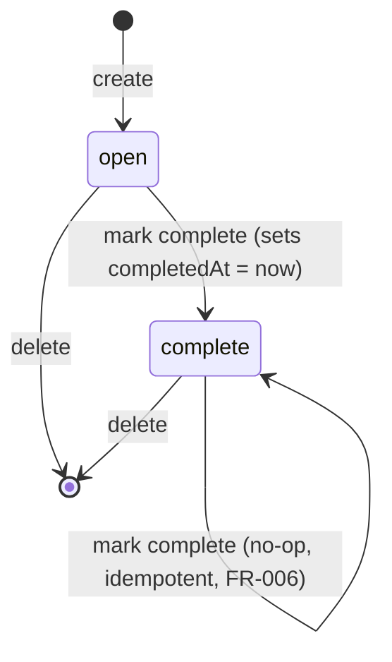

# Data Model: Tasks API

**Feature**: 001-tasks-api
**Date**: 2026-07-01

## Entities

### Task

The single domain entity. Represents one unit of work.

| Field | Type | Required | Notes |
|-------|------|----------|-------|
| `id` | string (UUID v4, canonical hyphenated form) | Yes | Server-assigned via `crypto.randomUUID()`. Immutable. |
| `title` | string | Yes | 1–500 characters after trimming. Empty/whitespace-only rejected. |
| `dueDate` | string (`YYYY-MM-DD`) \| `null` | No | Calendar date, no time. Any parseable ISO date; stored normalized. |
| `status` | `"open"` \| `"complete"` | Yes | Defaults to `"open"` on creation. |
| `createdAt` | string (ISO 8601 UTC, ms precision) | Yes | Server-assigned at creation. Immutable. |
| `completedAt` | string (ISO 8601 UTC, ms precision) \| `null` | No | Set when `status` transitions to `"complete"`. Cleared to `null` never (see State Transitions). |

**Derived at read time (not stored)**:

| Field | Type | Derivation |
|-------|------|------------|
| `overdue` | boolean | `status === "open" && dueDate !== null && dueDate < today` where `today` is the server's local calendar date at the moment of the list call. |

### TaskStore (persistence envelope)

Not a domain entity, but the on-disk shape. One instance per process.

```jsonc
{
  "schemaVersion": 1,   // integer, currently 1
  "tasks": Task[]       // in insertion order; consumers must not rely on this order for display
}
```

## Validation Rules

Enforced by Zod at the HTTP boundary (`routes/task-routes.ts`) before any
service call:

- `title`: `z.string().trim().min(1).max(500)`.
- `dueDate`: `z.string().regex(/^\d{4}-\d{2}-\d{2}$/).optional().nullable()`,
  additionally required to parse as a real calendar date (Feb 30 rejected).
- Body-level: unknown extra properties are stripped (Zod `.strict()` is NOT
  used, so forward compatibility isn't broken by future fields).
- Path `id`: must match the UUID v4 pattern; anything else returns
  `NotFoundError` (never a 400) so probing behavior is uniform.

Validation failures throw `ValidationError` with a `details` array of
`{ path, message }` pulled from the Zod error.

## State Transitions



- **create → open**: `id`, `title`, `createdAt` set; `dueDate` set or null;
  `status = "open"`; `completedAt = null`.
- **open → complete**: `status := "complete"`, `completedAt := now (UTC ISO)`.
- **complete → complete** (repeat mark): no field changes, no write to disk.
  Idempotency is asserted by comparing before/after task equality; if equal,
  the repository is not called.
- **delete**: the task is removed from the in-memory list and persisted.
  There is no "restore".

## Invariants

1. `id` is unique across all tasks in the store at all times.
2. `completedAt !== null` if and only if `status === "complete"`.
3. `createdAt <= completedAt` when `completedAt !== null`.
4. `title.length >= 1` after `trim()`.
5. If `dueDate !== null`, it is a valid calendar date (round-trips through a
   date parser without loss).
6. `schemaVersion === 1`.

Invariants 1–5 are enforced by service-layer construction; invariant 6 is
enforced on load (any other value → `StoreCorruptError`).

## Relationships

None. Single entity, no foreign keys, no join model.

## Notes on non-storage

- `overdue` is deliberately **not** stored. Storing a derived, time-dependent
  flag would introduce a stale-data class of bug that no test could reliably
  catch. Recomputed per request.
- `today` for the overdue check is captured **once per list call** to avoid
  cross-task inconsistency at a midnight boundary (see research Decision 7).
