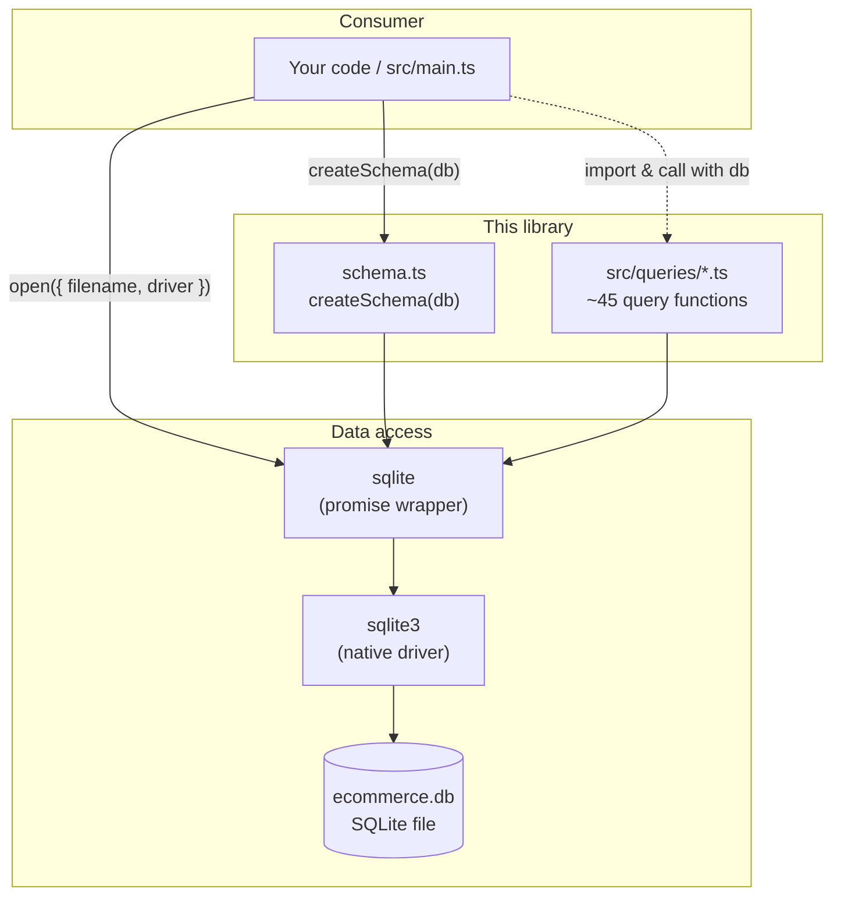
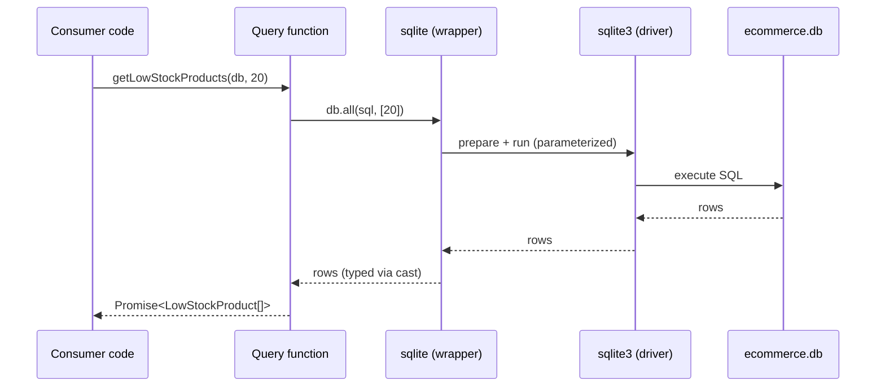
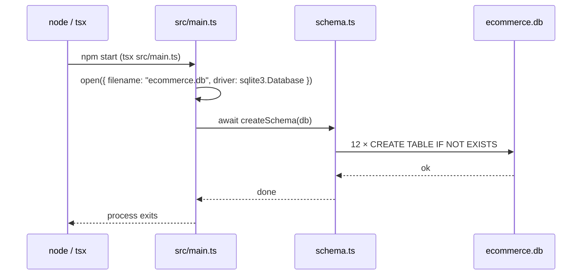
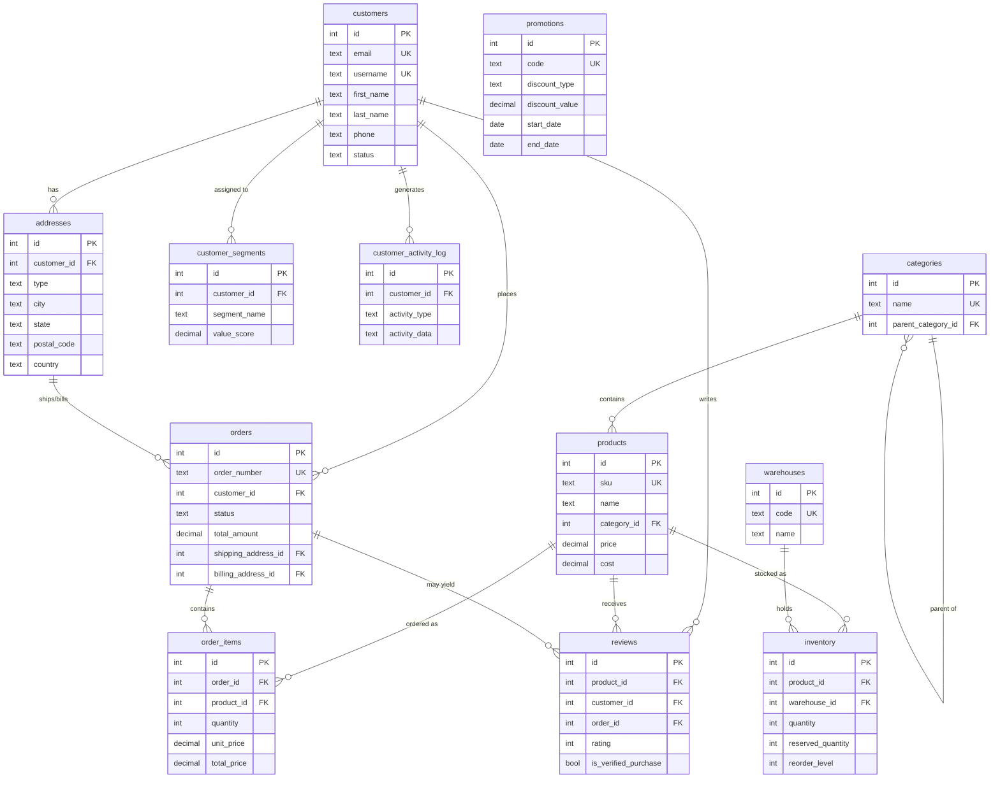

# E-commerce Query Utils

A **TypeScript library of read-only SQLite query functions** for an e-commerce data model. It packages a relational schema (`createSchema`) and a catalogue of ~45 typed, parameterized SQL queries spanning customers, products, orders, inventory, reviews, promotions, shipping, and analytics.

It is a **data-access / utilities layer** — not a web server. There is no HTTP API, no router, no authentication middleware, and no background worker. The "API" is the set of exported TypeScript functions you import and call with a `Database` connection.

---

## Table of Contents

- [Project Overview](#project-overview)
- [Architecture](#architecture)
- [Folder Structure](#folder-structure)
- [Technology Stack](#technology-stack)
- [Installation Guide](#installation-guide)
- [Environment Variables](#environment-variables)
- [Project Workflow](#project-workflow)
- [API Documentation (Query Functions)](#api-documentation-query-functions)
- [Database](#database)
- [Build & Deployment](#build--deployment)
- [Available Scripts](#available-scripts)
- [Testing](#testing)
- [Troubleshooting](#troubleshooting)
- [Design Decisions](#design-decisions)
- [Known Limitations](#known-limitations)
- [Future Improvements](#future-improvements)
- [Contributing](#contributing)
- [License](#license)

---

## Project Overview

### Purpose
Provide a clean, reusable, strongly-typed set of SQL helper functions for an e-commerce SQLite database, so application code can answer common business questions (e.g. "which products are low on stock?", "who are my repeat customers?", "which orders are still pending?") without re-writing SQL.

### Problem it solves
E-commerce reporting and operational queries are repetitive, easy to get wrong, and prone to SQL injection when assembled ad hoc. This project centralizes those queries in one place where they are:
- **Parameterized** (safe against SQL injection),
- **Typed** (result shapes described by TypeScript interfaces),
- **Dependency-injected** (every function takes the `Database` handle as its first argument, making it trivial to test and to point at any SQLite connection),
- **Organized by domain** (one module per concern under `src/queries/`).

### Key features
- 🗄️ **Schema bootstrapping** — `createSchema(db)` creates 12 related tables idempotently (`CREATE TABLE IF NOT EXISTS`).
- 🔎 **~45 query functions** across 8 domain modules.
- 🛡️ **Parameterized SQL** throughout — no string-concatenated user input.
- 🧩 **Promise-based API** via the `sqlite` wrapper (`db.get` / `db.all`).
- 🧪 **Type-safe** — `strict` TypeScript, executed directly with `tsx` (no build step required for development).
- 🤖 **Claude Code tooling** — repository ships with example hooks (type-check gate, query-duplication reviewer) and an Agent SDK demo.

---

## Architecture

This is a layered library. Consumer code obtains a `Database` connection and passes it into pure query functions.



### Module responsibilities
Every query module is a **leaf module**: it imports only the `Database` type from `sqlite`, never another query module, and is never imported by another query module. There is no shared mutable state and no connection singleton — the `Database` is always passed in.

### Request lifecycle (a single query call)



### Startup / system workflow (the bundled entry point)



> Note: `src/main.ts` only creates the schema. It does **not** invoke any query functions — the query modules are a library intended for import by consumer code.

---

## Folder Structure

```
.
├── src/
│   ├── main.ts                 # Entry point: opens ecommerce.db and runs createSchema
│   ├── schema.ts               # createSchema(db) — defines & creates 12 tables
│   └── queries/                # All database queries live here (one module per domain)
│       ├── customer_queries.ts     # Customer lookups, segments, profiles, search
│       ├── product_queries.ts      # Catalog, stock levels, SKU lookup, reorder
│       ├── order_queries.ts        # Order details, status, recent/high-value orders
│       ├── analytics_queries.ts    # CLV, sales-by-category, repeat customers, trends
│       ├── inventory_queries.ts    # Warehouse stock, availability, transfers, movements
│       ├── promotion_queries.ts    # Active/expiring promos, eligibility, performance
│       ├── review_queries.ts       # Product/customer reviews, ratings, verification
│       └── shipping_queries.ts     # Shipping addresses, destinations, delays
├── hooks/                      # Claude Code hooks (dev tooling — NOT app runtime)
│   ├── query_hook.js               # PreToolUse: duplicate-query reviewer (currently dormant)
│   ├── read_hook.js                # PreToolUse: blocks reading .env (not wired in by default)
│   └── tsc.js                      # PostToolUse: TypeScript type-check gate
├── scripts/
│   └── init-claude.js          # `npm run setup`: generates .claude/settings.local.json
├── .claude/
│   └── settings.example.json   # Hook configuration template ($PWD placeholders)
├── sdk.ts                      # Demo: drives @anthropic-ai/claude-agent-sdk (`npm run sdk`)
├── tsconfig.json               # Strict TS, ES2022, ESM, outDir ./dist
├── package.json                # Scripts & dependencies
├── .env.example                # Documents required env vars (copy to .env)
├── CLAUDE.md                   # Guidance for Claude Code in this repo
├── task.md                     # Original feature brief (historical context)
└── README.md
```

> **Critical convention:** *all database queries must live in `src/queries/`.* This is enforced/encouraged by the `hooks/query_hook.js` Claude Code hook and stated in `CLAUDE.md`.

---

## Technology Stack

| Layer | Technology | Version | Purpose |
|---|---|---|---|
| Language | **TypeScript** | ^5.8 | Strongly-typed source (`strict: true`) |
| Runtime | **Node.js** | ≥ 18 (tested on 22) | JavaScript runtime (ESM) |
| TS execution | **tsx** | ^4.20 | Run `.ts` directly without a build step |
| Database | **SQLite** | via `sqlite3` ^5.1 | Embedded relational database |
| DB wrapper | **sqlite** | ^5.1 | Promise-based API over `sqlite3` (`db.get`/`db.all`/`db.exec`) |
| Types | **@types/node** | ^24 | Node type definitions |
| Dev demo | **@anthropic-ai/claude-agent-sdk** | ^0.1.5 | Agent SDK demo (`sdk.ts`) |

There is **no web framework, ORM, bundler, linter, or test framework** configured. Module system is **ESM** (`"type": "module"`).

---

## Installation Guide

### Prerequisites
- **Node.js ≥ 18** (LTS 20/22 recommended) and **npm**.
- A C/C++ toolchain for building the native `sqlite3` addon (prebuilt binaries are used when available; otherwise `node-gyp` will compile). On macOS, Xcode Command Line Tools; on Debian/Ubuntu, `build-essential` and `python3`.

### 1. Clone the repository
```bash
git clone https://github.com/ANI-IN/ecommerce-query-utils.git
cd ecommerce-query-utils
```

### 2. Install dependencies
```bash
npm install
```
Or run the bundled setup (installs deps **and** generates local Claude Code hook config):
```bash
npm run setup
```

### 3. Environment setup
```bash
cp .env.example .env
# edit .env if you intend to exercise the .env-protection tooling / Agent SDK demo
```

### 4. Configuration
No application configuration is required to create the schema. The database filename (`ecommerce.db`) is currently hard-coded in `src/main.ts`. `tsconfig.json` controls type-checking/build behavior.

### 5. Run locally
```bash
npm start        # runs src/main.ts via tsx → creates ./ecommerce.db with all tables
npm run typecheck  # tsc --noEmit (validates types)
npm run build      # tsc → emits compiled JS to ./dist
```

---

## Environment Variables

Environment variables are documented in `.env.example`. The actual `.env` file is **git-ignored**.

| Variable | Required | Purpose | Format | Example |
|---|---|---|---|---|
| `SECRET_API_KEY` | No | Sample secret used to demonstrate the `.env`-protection hook (`hooks/read_hook.js`). **No application code currently reads it.** | string | `SECRET_API_KEY="your-secret-api-key-here"` |

> The Agent SDK demo (`sdk.ts`) authenticates using your ambient Claude Code / Anthropic credentials, not a variable from this `.env`.

---

## Project Workflow

### Startup process
1. `npm start` runs `src/main.ts` through `tsx`.
2. `main.ts` opens a SQLite connection to `ecommerce.db` using `open()` from the `sqlite` wrapper with the `sqlite3` driver.
3. `await createSchema(db)` executes 12 idempotent `CREATE TABLE IF NOT EXISTS` statements.
4. The process exits. The connection is not explicitly closed (the process termination releases it).

### Data flow (using the library)
A consumer is expected to:
1. Open a `Database` connection (same `open(...)` pattern as `main.ts`).
2. Optionally call `createSchema(db)` to ensure tables exist.
3. Import the relevant query function(s) from `src/queries/*` and call them, passing `db` first.

```ts
import { open } from "sqlite";
import sqlite3 from "sqlite3";
import { createSchema } from "./src/schema";
import { getLowStockProducts } from "./src/queries/product_queries";

const db = await open({ filename: "ecommerce.db", driver: sqlite3.Database });
await createSchema(db);

const lowStock = await getLowStockProducts(db, 20);
console.log(lowStock);
```

### Database interactions
- **Single-row reads** use `db.get(sql, params)`.
- **Multi-row reads** use `db.all(sql, params)`.
- **DDL** uses `db.exec(sql)` (schema creation only).
- All parameters are bound with `?` placeholders.

### Business logic
Most logic lives in SQL (joins, CTEs, window functions, aggregates). A handful of functions post-process in JavaScript — e.g. computing date cutoffs (`fetchActiveCustomers`, `findExpiringPromotions`), averaging days-between-orders (`findRepeatCustomers`), and reshaping rows into nested objects (`getOrderDetails`).

### Authentication / authorization
**None.** This is a local data-access library with no user/session concept. Access control is the responsibility of whatever application embeds it.

### Error handling
Query functions do not wrap calls in `try/catch`; they let the underlying `sqlite` promise **reject**, so callers should handle rejections (e.g. `try/catch` or `.catch()`). There is no logging layer.

---

## API Documentation (Query Functions)

> "Endpoints" here are exported functions. Every function takes `db: Database` as its first parameter and returns a `Promise`. Reads use `db.get` (single object or `null`/`undefined`) or `db.all` (array). Errors surface as a rejected promise.

### `customer_queries.ts`
| Function | Parameters (after `db`) | Returns | Reads |
|---|---|---|---|
| `getCustomerByEmail` | `email: string` | `Promise<any>` | `db.get` |
| `fetchActiveCustomers` | `daysInactive = 90` | `Promise<any[]>` | `db.all` |
| `findCustomersBySegment` | `segmentName: string` | `Promise<any[]>` | `db.all` |
| `getCustomerProfile` | `customerId: number` | `Promise<any \| null>` | `db.get` ×3 + `db.all` ×2 |
| `searchCustomersByName` | `firstName?: string, lastName?: string` | `Promise<any[]>` | `db.all` |
| `listCustomersWithReviews` | — | `Promise<any[]>` | `db.all` |

### `product_queries.ts`
| Function | Parameters (after `db`) | Returns | Reads |
|---|---|---|---|
| `getProductDetails` | `productId: number` | `Promise<ProductDetails \| null>` | `db.get` |
| `findProductsByCategory` | `categoryId: number` | `Promise<ProductByCategory[]>` | `db.all` |
| `getLowStockProducts` | `threshold = 20` | `Promise<LowStockProduct[]>` | `db.all` |
| `fetchProductBySku` | `sku: string` | `Promise<ProductBySku \| null>` | `db.get` |
| `listAvailableProducts` | — | `Promise<AvailableProduct[]>` | `db.all` |
| `getProductsNeedingReorder` | — | `Promise<ProductNeedingReorder[]>` | `db.all` |
| `searchProductsByName` | `searchTerm: string` | `Promise<ProductSearchResult[]>` | `db.all` |

### `order_queries.ts`
| Function | Parameters (after `db`) | Returns | Reads |
|---|---|---|---|
| `getOrderDetails` | `orderId: number` | `Promise<OrderDetails \| null>` | `db.all` (reshaped) |
| `fetchCustomerOrders` | `customerId: number, limit = 10` | `Promise<any[]>` | `db.all` |
| `getPendingOrders` | — | `Promise<any[]>` | `db.all` |
| `findOrdersByStatus` | `status: string` | `Promise<any[]>` | `db.all` |
| `getRecentOrders` | `days = 7` | `Promise<any[]>` | `db.all` |
| `fetchOrdersByDateRange` | `startDate: string, endDate: string` | `Promise<any[]>` | `db.all` |
| `getHighValueOrders` | `minAmount = 500` | `Promise<any[]>` | `db.all` |

### `analytics_queries.ts`
| Function | Parameters (after `db`) | Returns | Reads |
|---|---|---|---|
| `calculateCustomerLifetimeValue` | `customerId: number` | `Promise<CustomerLifetimeValue \| {}>` | `db.get` + `db.all` |
| `getSalesByCategory` | `startDate: string, endDate: string` | `Promise<CategorySales[]>` | `db.all` + per-row reads |
| `findRepeatCustomers` | `minOrders = 2` | `Promise<RepeatCustomer[]>` | `db.all` |
| `getProductPerformance` | `productId: number` | `Promise<ProductPerformance \| {}>` | `db.get` ×4 + `db.all` |
| `calculateSegmentMetrics` | `segmentName: string` | `Promise<SegmentMetrics \| {...}>` | `db.get` + `db.all` ×2 |
| `findTrendingProducts` | `days = 30` | `Promise<TrendingProduct[]>` | `db.all` |

### `inventory_queries.ts`
| Function | Parameters (after `db`) | Returns | Reads |
|---|---|---|---|
| `getWarehouseInventory` | `warehouseId: number` | `Promise<WarehouseInventoryItem[]>` | `db.all` |
| `checkProductAvailability` | `productId: number` | `Promise<ProductAvailability[]>` | `db.all` |
| `findStockTransfersNeeded` | — | `Promise<StockTransfer[]>` | `db.all` |
| `getInventoryValueByWarehouse` | — | `Promise<WarehouseInventoryValue[]>` | `db.all` |
| `fetchReservedInventory` | — | `Promise<ReservedInventoryItem[]>` | `db.all` |
| `getInventoryMovements` | `days = 30` | `Promise<InventoryMovement[]>` | `db.all` |

### `promotion_queries.ts`
| Function | Parameters (after `db`) | Returns | Reads |
|---|---|---|---|
| `getActivePromotions` | — | `Promise<Promotion[]>` | `db.all` |
| `checkPromoEligibility` | `customerId: number, promoCode: string` | `Promise<PromoEligibility>` | `db.get` |
| `findExpiringPromotions` | `days = 7` | `Promise<ExpiringPromotion[]>` | `db.all` |
| `getPromotionPerformance` | `promoId: number` | `Promise<PromotionPerformance \| null>` | `db.get` |
| `findUnusedPromotions` | — | `Promise<UnusedPromotion[]>` | `db.all` |

### `review_queries.ts`
| Function | Parameters (after `db`) | Returns | Reads |
|---|---|---|---|
| `getProductReviews` | `productId: number, limit = 50` | `Promise<Review[]>` | `db.all` |
| `fetchCustomerReviews` | `customerId: number` | `Promise<Review[]>` | `db.all` |
| `findUnverifiedReviews` | — | `Promise<Review[]>` | `db.all` |
| `getHelpfulReviews` | `minHelpful = 5` | `Promise<Review[]>` | `db.all` |
| `fetchRecentReviews` | `days = 7` | `Promise<Review[]>` | `db.all` |
| `getReviewsByRating` | `rating: number` | `Promise<Review[]>` | `db.all` |

### `shipping_queries.ts`
| Function | Parameters (after `db`) | Returns | Reads |
|---|---|---|---|
| `getShippingAddresses` | `customerId: number` | `Promise<ShippingAddress[]>` | `db.all` |
| `findOrdersByDestination` | `state: string` | `Promise<OrderByDestination[]>` | `db.all` |
| `getUnshippedOrders` | — | `Promise<UnshippedOrder[]>` | `db.all` |
| `calculateShippingCostsByState` | — | `Promise<ShippingCostByState[]>` | `db.all` |
| `findDeliveryDelays` | `expectedDays = 5` | `Promise<DeliveryDelay[]>` | `db.all` |

> ⚠️ Several queries currently reference table/column names that differ from those produced by `schema.ts`. See [Known Limitations](#known-limitations).

---

## Database

### Choice
**SQLite**, via the `sqlite3` native driver wrapped by the promise-based `sqlite` package. SQLite is a zero-configuration, file-based embedded database — ideal for a self-contained utilities/demo project. The database lives in a single file (`ecommerce.db`).

### Schema / models
`createSchema(db)` in `src/schema.ts` defines 12 tables. All use an `INTEGER PRIMARY KEY AUTOINCREMENT` `id`, with `CHECK` constraints on enumerated columns (e.g. order `status`, address `type`) and `FOREIGN KEY` references between tables.

### Relationships (ER diagram)



### Migration / setup process
There is no migration tool. The schema is created idempotently by calling `createSchema(db)` (run `npm start`, which does exactly this against `ecommerce.db`). Because every statement uses `IF NOT EXISTS`, re-running is safe and non-destructive. There is no seed data.

---

## Build & Deployment

### Development mode
Run TypeScript directly with `tsx` — no compilation needed:
```bash
npm start          # tsx src/main.ts
npm run typecheck  # tsc --noEmit (no output, just validation)
```

### Production build
Compile to plain JavaScript in `./dist`:
```bash
npm run build      # tsc → ./dist (mirrors repo layout: dist/src/main.js, etc.)
node dist/src/main.js
```

### Deployment
As a library/utility it is typically embedded into another project (import the query functions). If deployed standalone, package the source plus `dist/` and `node_modules` (or install on the target), ensuring the platform can load the native `sqlite3` binary. There is **no Docker, CI/CD, or cloud configuration** in this repository.

### Configuration requirements
- Node.js ≥ 18 on the target.
- Native `sqlite3` build support (or a compatible prebuilt binary).
- Write access to the directory where `ecommerce.db` is created.

---

## Available Scripts

| Script | Command | Description |
|---|---|---|
| `npm run setup` | `npm install && node ./scripts/init-claude.js` | Install dependencies, then generate `.claude/settings.local.json` from the template (substitutes `$PWD`). Wires up the Claude Code hooks. |
| `npm start` | `tsx src/main.ts` | Run the entry point: open `ecommerce.db` and create the schema. |
| `npm run build` | `tsc` | Type-check and emit compiled JS to `./dist`. |
| `npm run typecheck` | `tsc --noEmit` | Type-check only (the project's main correctness gate). |
| `npm run sdk` | `tsx sdk.ts` | Demo of `@anthropic-ai/claude-agent-sdk` (runs a one-shot agent query). |
| `npm test` | echo + exit 0 | Placeholder — no test suite is configured yet (see [Testing](#testing)). |

---

## Testing

There is **no automated test suite** at this time. `npm test` is a documented placeholder that exits successfully without running anything.

The de-facto validation gates are:
```bash
npm run typecheck   # strict TypeScript type-checking (must pass with 0 errors)
npm run build       # full compile to ./dist (must succeed)
npm start           # runs end-to-end; creates ecommerce.db with all 12 tables
```

A `hooks/tsc.js` Claude Code PostToolUse hook additionally runs the type-checker automatically after every file edit when working inside Claude Code.

See [Future Improvements](#future-improvements) for the recommended testing setup.

---

## Troubleshooting

| Symptom | Likely cause | Fix |
|---|---|---|
| `node-gyp` / native build errors during `npm install` | Missing C/C++ toolchain for `sqlite3` | Install build tools (Xcode CLT on macOS; `build-essential` + `python3` on Linux) and re-run `npm install`. |
| `Cannot find module 'sqlite'` when running a script | Script executed outside the project root, so Node can't resolve `node_modules` | Run from the project root (or place scratch scripts inside it). |
| `Top-level await is currently not supported with the "cjs" output format` | Running a `.ts` file in a directory without `"type": "module"` | Wrap top-level `await` in an `async function`, or run from a directory whose `package.json` sets `"type": "module"`. |
| `SQLITE_ERROR: no such table/column` when calling a query | The query targets a schema that differs from `schema.ts` | See [Known Limitations](#known-limitations) — align the query or schema before use. |
| Hooks not running in Claude Code | `.claude/settings.local.json` not generated | Run `npm run setup` (or `node ./scripts/init-claude.js`). |

---

## Design Decisions

- **TypeScript, kept as-is (no JS migration).** The application source under `src/` is already consistent, strict TypeScript with ~45 result interfaces and fully-typed signatures. Converting to JavaScript would discard meaningful type contracts and remove the project's primary correctness gate (`tsc`), with no offsetting benefit. The only `.js` files are Claude Code hooks/scripts, which **must** remain `.js` because they are invoked directly via `node`.
- **Dependency injection of the `Database`.** Passing `db` into every function (rather than using a module-level singleton) keeps functions pure, easy to test, and connection-agnostic.
- **Promise-based `sqlite` wrapper over raw `sqlite3` callbacks.** Cleaner `async/await` code than the callback-style API shown in older docs.
- **Run via `tsx`, optional `tsc` build.** Fast local iteration with no build step; a real `tsc` build to `./dist` is available for production.
- **Domain-partitioned query modules.** One file per concern keeps related SQL together and is enforced by convention (`src/queries/`).
- **Runtime dependencies trimmed.** Only `sqlite` and `sqlite3` are runtime dependencies; `typescript`, `tsx`, `@types/node`, and the Agent SDK demo are dev-only.

---

## Known Limitations

> **Session-starter checkpoint.** This copy of the project has Milestones 1–3 of the Advanced Assignment ("Operation Stale Orders") already complete — see [`constitution.md`](./constitution.md), [`specs/stale-order-alerts/spec.md`](./specs/stale-order-alerts/spec.md), [`worksheet.md`](./worksheet.md), and the three hooks in `hooks/`. **Milestone 4 (implementing the feature itself + the MCP server) is the live 2-hour session's job** — see the root [`README.md`](../README.md) for the session agenda. The bullets below reflect what's fixed already vs. what you're about to build.

- **Schema ↔ query mismatch (pre-existing).** Several query modules were authored against a different schema variant than the one `createSchema` builds. They reference tables that don't exist in `schema.ts` (e.g. `shipping_addresses`, `segments`, `order_promotions`, `cart_items`) and `_id`-suffixed primary keys (`customer_id`, `product_id`, …) where the created tables use `id`. As a result, **invoking many query functions against a database built by `createSchema` raises `SQLITE_ERROR: no such table/column` at runtime.** This is a data-layer mismatch (not a type error — rows are typed loosely and SQL is plain strings, so `tsc` cannot catch it). Reconciling the queries and schema is the highest-value next step (see below). — ✅ **Already fixed** (M2): `order_queries.ts`/`customer_queries.ts` are fully reconciled, with a test per function.
- **The entry point does not use the queries.** `src/main.ts` only creates the schema; the query functions are a library for external import. — Stays this way by design (constitution §3) — the alert feature you're about to build is a *separate* entry point, not a change to `main.ts`.
- **No seed data, no automated tests, no linter.** — ✅ **Already fixed** (seed/tests, M2): Vitest added, 16 tests across 3 files. No linter — a stated decision (constitution §4), not an oversight.
- **Weak typing at the data boundary.** Result rows are frequently typed as `any` then cast to interfaces; `customer_queries`/`order_queries` largely return `Promise<any[]>`. — Still true outside `getOrderDetails`; out of scope to fix further here.

---

## Future Improvements

1. ~~**Reconcile queries with the schema**~~ — ✅ done (M2, see above).
2. ~~**Add a test suite**~~ — ✅ done (M2, Vitest + in-memory `:memory:` DB via `createSchema`).
3. **Add a linter/formatter** (ESLint + Prettier) — deliberately still open (constitution §4).
4. **Add CI** (GitHub Actions) running `typecheck`, `build`, and tests on push/PR. — still open.
5. **Tighten types** — replace `any`/`{}` returns with concrete interfaces and use `db.get<T>()`/`db.all<T>()` generics. — still open.
6. **Externalize configuration** — make the database filename configurable (env var / parameter) instead of hard-coding `ecommerce.db`. — still open.
7. **Address the N+1 pattern** in `analytics_queries.getSalesByCategory`. — still open; out of scope.
8. **Implement the original brief** in `task.md` (daily cron that finds long-pending orders and posts a masked alert) — **this is today's live session.** The spec is already written ([`specs/stale-order-alerts/spec.md`](./specs/stale-order-alerts/spec.md), v1.2) — implement `findStalePendingOrders`, `src/alerts/format.ts`, `src/alerts/outbox.ts`, `src/alert-check.ts`, and `mcp/alert-server.ts` against it through Plan Mode.

---

## Contributing

This repository is currently maintained **solely by Animesh**. External contributions are not being accepted at this time.

If you are working in this repository:
1. Keep all database queries in `src/queries/` (project convention).
2. Use parameterized queries (`?` placeholders) — never interpolate user input into SQL.
3. Ensure `npm run typecheck` passes with zero errors before committing.
4. Follow the existing module structure and naming conventions.

---

## License

Released under the **ISC License**. See [`LICENSE`](./LICENSE) for the full text.

---

## Live Session Walkthrough (this is the actual task for today)

This section is the step-by-step guide for a compressed live session built around this folder — see the root [`../README.md`](../README.md) for the full, equally-weighted walkthrough of all four milestones, and Section 9 there for how to decide whether this M1-3-pre-built format is the right choice for your room. Everything below happens **inside this folder.**

### What's already done (M1–3) — read this, don't redo it

- **`constitution.md`** — 5 non-negotiables: `schema.ts` is the immutable source of truth this release; all SQL lives in `src/queries/`, parameterized; query modules stay pure reads (no side effects); `npm run typecheck && npm test` must both exit 0 before anything is "done"; PII in outbound alerts is masked by default.
- **`specs/stale-order-alerts/spec.md`** (v1.2) — the full spec you're about to implement against, the product of a real 12-question adversarial interview (see the root README's Milestone 1 section for the actual transcript highlights). Read it before you start Plan Mode — the PII policy, the dedupe model `(order_id, calendar_day)`, the failure-mode split (a systemic outbox failure aborts the whole run; a single bad order is logged and skipped), and the exact outbox line shape (§2.1) are all already decided. Don't re-derive them; implement them.
- **`worksheet.md`** — the real M1–3 record (gap hunt, grill-me interview, plan interventions, blocked-hook transcripts) from building the reference solution this is checkpointed from. Worth skimming for context on *why* the spec says what it says.
- **`hooks/`** — `scope_guard.js` (blocks raw SQL outside `src/queries/`), `green_gate.js` (blocks ending your turn while `typecheck`/`test` are red), `audit_log.js` (append-only tool-call log). Wired in `.claude/settings.json`. Confirm they loaded: `/hooks` should show all three.

**One lesson from building M1–3 worth carrying into today:** a capable, rule-aware agent will often satisfy a rule voluntarily *before* you ever see what enforcing it looks like — relocating a disallowed query instead of writing it where asked, fixing a red build before ever trying to stop. That looks identical to the guardrail working, but proves nothing. If you want to actually confirm a hook works today, you may need to explicitly tell the agent *not* to work around a rule and to attempt the violation anyway.

### Step 1 — implement the feature (Plan Mode, ~35 min)

```
/plan

Point me at specs/stale-order-alerts/spec.md and implement the stale-order-
alerts feature per that spec (v1.2) and constitution.md. Read both files
first. Expected shape:

- src/queries/order_queries.ts: findStalePendingOrders(db, thresholdDays=3,
  now) — parameterized, tested against the existing in-memory harness.
- src/alerts/format.ts: builds the alert payload per spec §2.1's exact field
  shape, applying the PII masking policy (mask by default; ALERT_INCLUDE_PII
  =true opts into raw values). Unit-tested both ways.
- src/alerts/outbox.ts: appends JSONL to outbox/alerts.jsonl (path
  overridable via ALERT_OUTBOX), creates the parent directory if missing,
  implements the (order_id, calendar_day) dedupe contract by reading the
  outbox before writing. The single delivery/dedupe implementation — no
  second one, even once the MCP server needs to write here too.
- src/alert-check.ts + an "alert:check" npm script — the cron entry point:
  query -> format -> deliver, one structured log line per outcome
  (sent/skipped-duplicate/error), exit 0 on success, exit 1 on delivery
  failure with no partial writes.
- scripts/seed-demo.ts + a "seed:demo" npm script — seeds 2 stale pending
  orders (>=4 and >=10 days old), 1 fresh pending order, 1 shipped order,
  all deterministic relative to an explicit reference time.

Ask me questions about anything the spec leaves ambiguous before writing a
plan. Tests should be interleaved with the implementation, not batched.
```

**Actually interrogate plan v1 before approving it** — don't rubber-stamp. Watch specifically for: any attempt to add a new column/table to `schema.ts` for dedupe bookkeeping (the spec already decided the outbox file itself is the dedupe record — `schema.ts` stays untouched, no exceptions); tests batched at the end instead of interleaved per file; the query accidentally using `julianday('now')` or similar wall-clock SQL instead of the injected `now`.

### Step 2 — build the MCP server (~30 min)

```
Write mcp/alert-server.ts — a stdio MCP server (McpServer + StdioServerTransport
+ zod). Two tools:
1. send_alert — input { channel, order_id, dedupe_key, summary, body }.
   Delivers through the same src/alerts/outbox.ts used by alert-check.ts —
   one delivery/dedupe implementation, two callers.
2. list_sent_alerts — input { channel? }. Reads back delivered alerts from
   the outbox so the agent can verify its own work.

Register it: claude mcp add --scope project alert-mcp -- npx tsx mcp/alert-server.ts
```

**Known gotcha, confirmed real building the reference solution:** a freshly-registered project-scoped MCP server does **not** show up in `/mcp` until the session restarts. Exit and start a fresh `claude` session (confirm your cwd is this folder — `.mcp.json` is project-scoped), then `/mcp` should list `alert-mcp` connected with 2 tools. Budget this restart — it's expected, not a bug to debug.

**A real design question worth asking before you consider this done** — this exact gap was found building the reference solution: `send_alert` and `alert-check.ts` now both write into the same outbox, sharing one `(order_id, calendar_day)` dedupe key by default. That means an unrelated manual alert for an order could silently suppress that day's automated stale-order alert for the *same* order, or vice versa — neither the feature spec nor an MCP-specific spec addressed this (the feature spec deliberately deferred the MCP tool's own contract). Ask your agent directly:
```
send_alert and alert-check.ts now share one dedupe namespace
(order_id, calendar_day) in the same outbox. Was that deliberate, or should
they be namespaced separately (e.g. a source field)? If not deliberate, fix
it.
```
The reference solution's fix: add a `source` field to the outbox's internal dedupe key — automated alerts stay unset/default-bucketed (the public line shape is unchanged), manual `send_alert` calls get `source: "mcp-send-alert"`. This is genuinely not obvious until both callers exist.

### Step 3 — the end-to-end run (~15 min), fresh session

```
Run the stale-order alert operation end to end and verify your own work:
1. Delete ecommerce.db, recreate the schema, and run scripts/seed-demo.ts.
2. Run `npm run alert:check`.
3. Use the alert-mcp list_sent_alerts tool to report exactly how many
   alerts were delivered and for which order ids.
4. Run `npm run alert:check` again, then use list_sent_alerts to prove
   no duplicates were added.
Report what you did and what the outbox proves, step by step.
```
Expect: exactly the 2 seeded stale orders delivered (fresh/shipped excluded), second run produces zero new lines. Then one manual delivery for good measure: *"Use `send_alert` to deliver a test alert to `#order-alerts` for order 999 with dedupe key `manual-test-1`, then confirm it via `list_sent_alerts`."*

### Step 4 — the failure drill (~10 min)

```bash
ALERT_OUTBOX="./ecommerce.db/alerts.jsonl" npm run alert:check; echo "exit=$?"
```
`./ecommerce.db` is a file, not a directory, on every OS — an impossible path that forces a clean failure without faking a full disk. Expect: exit code ≠ 0, one structured error log line, and the real `outbox/alerts.jsonl` confirmed byte-unchanged afterward (`cat outbox/alerts.jsonl | wc -l` before and after should match).

### Step 5 — close the paperwork (~10 min)

Fill in `worksheet.md`'s M4 section: the plan v1 → intervention → v2 for the implementation, the dedupe-namespace defect → spec-patch row (a second one, if you find another — the assignment wants ≥2 total across the whole build), the e2e run summary, the failure-drill result, steering failures (even if none), and a one-paragraph closing reflection. Commit and push your branch.

---

## Repo Map, Build Notes, and a Sample 2-Hour Compressed Agenda

> The root [`README.md`](../README.md) is now the full, end-to-end, milestone-by-milestone build guide (all four milestones, equal depth) — read that first for the actual step-by-step walkthrough of what to build. What follows here is the repo map and build narrative that used to live at the root, plus **one example** of how you might compress this into a 2-hour live session using this folder as the starting point. It's a starting point for that decision, not a prescription — an instructor may reasonably choose a different split (e.g. running Milestone 1's interview live instead of pre-baked, since that's the heart of the spec-driven-development teaching goal). All paths below are relative to the **repo root** (one level up from this folder), same as they'd read from `../README.md`.

For pitch scripts, the grading rubric, and the original answer key, see `../Advance Assignment/FACILITATOR-NOTES.md`.

---

## 1 · What's in this repo now

| Folder | What it is | Status |
|---|---|---|
| `Advance Assignment/` | The original assignment brief (`README.md`), facilitator notes, and a blank learner `worksheet.md` template | Pre-existing |
| `Hooks/`, `MCP/`, `part-3-claude-plan-mode/`, `part-4-spec-driven-dev/` | Day 2 lab source material this assignment draws on | Pre-existing |
| **`final-complete-project/`** | **A fully built, live-verified reference solution** — all 4 milestones done, 41/41 tests passing, hooks proven to actually block (not just synthetically), the feature + MCP server working end-to-end including a real failure drill | **New** |
| **`session-starter/`** | **The 2-hour live-session starting point** — Milestones 1–3 already done (constitution, spec, reconciled queries with tests, all three hooks), Milestone 4 stripped out for the live session to build | **New** |

`../final-complete-project/worksheet.md` is the fullest artifact here — it's not a template, it's the actual, honest record of a real build: every gap-hunt question, the full 12-question spec interview, every plan-v1 intervention, real blocked-hook transcripts (including the ones that turned out *not* to prove anything the first time), both logged defect→spec amendments, and a closing reflection. Read it before you facilitate — it's the single best preparation for anticipating where learners will get stuck.

---

## 2 · What actually happened, building this today

The reference solution was built the way the assignment itself demands: spec before code, every plan interrogated before approval, every hook verified live, nothing marked "done" until forced to prove it. A few concrete numbers:

- **M1**: a genuine 12-question adversarial interview (not a rubber-stamped one) surfaced the PII policy, the re-alert/dedupe model, the schema-truth boundary, and — a good teaching moment — a case where the interviewing agent caught the *builder* smuggling in an undeclared assumption (referencing "the MCP contract" before anything had established one existed). The spec went through two full quality-checklist passes and two amendments (versioned v1.0 → v1.1 → v1.2) before being called done.
- **M2**: `order_queries.ts` and `customer_queries.ts` fully reconciled to `schema.ts`, with Plan Mode surfacing four real design questions (address-type filtering, segment-expiry semantics, a 1:N field needing a `GROUP_CONCAT` decision, and a field-renaming choice) before any code was written — plus one execution-drift catch: the field-renaming decision was applied inconsistently across functions until asked about directly.
- **M3**: all three hooks (scope guard, stop-gate, audit trail) built and — critically — verified **live**, not just by feeding synthetic stdin to the scripts. The first two attempts to prove the scope guard blocks a violation didn't actually test anything, because the agent voluntarily relocated the query before the hook ever fired. Only forcing the literal violation produced a real block. Same pattern repeated for the stop-gate.
- **M4**: the feature (`findStalePendingOrders` → PII-masked `format.ts` → deduped `outbox.ts` → `alert-check.ts`) plus an `alert-mcp` MCP server (`send_alert`, `list_sent_alerts`), verified with a real seeded end-to-end run (2 stale orders alerted, fresh/shipped correctly excluded, a second run proving zero duplicates, a manual MCP delivery, and a failure drill with confirmed no-partial-writes).

### New findings worth folding into the existing answer key

`../Advance Assignment/FACILITATOR-NOTES.md` §3 lists 9 planted challenges. Building the reference solution surfaced two more, genuinely worth grading for:

- **#10 — Dedupe-namespace collision between callers.** Once `send_alert` (MCP, manual) and `alert-check.ts` (automated) both write into the same outbox, they share one `(order_id, calendar_day)` dedupe key unless a submission explicitly separates them (e.g. a `source` field). A submission that never notices this will have a manual alert silently suppress — or get suppressed by — an unrelated automated one. Not obvious until you actually build both callers; a strong submission catches it, most won't.
- **#11 — "It works" vs. "I watched it fail."** The single most repeated lesson across M3 and M4 today: an agent asked to prove a guardrail works will often *satisfy the rule voluntarily* (relocate the query, fix the type error) before the guardrail ever fires — which looks identical to success but proves nothing. The assignment's own line ("a hook you haven't seen block is a hook you haven't tested") is meant literally. When grading a worksheet's blocked-hook transcript, check whether the violation was actually attempted, not routed around.

---

## 3 · Running this live, in 2 hours

The original design is self-paced homework sized at 4.5–6.5 hours. A live, instructor-driven 2-hour session can't rebuild all four milestones from scratch — so the format below front-loads M1–M3 as pre-work / pre-embedded material, and spends the live time on M4, the most demonstrable and novel milestone (the feature + an agent-built MCP server verifying its own work).

### Pre-work (before the session — ~20–30 min, async)

Send learners `session-starter/` and have them, individually, before the session:
1. Copy `session-starter/` to their own working directory, `npm install`, confirm `npm run typecheck && npm test` are clean (16 tests should pass).
2. Read `constitution.md`, `specs/stale-order-alerts/spec.md`, and `worksheet.md` in that folder — these represent Milestones 1–3, already done, so they walk in already oriented rather than cold.
3. Skim the three hooks in `hooks/` and how they're wired in `.claude/settings.json`.

This means the live session opens with everyone already past the "why does this repo crash at runtime" discovery and the spec-writing slog — which is real time saved, but also real context worth narrating briefly at the start (see agenda below), since skipping straight to M4 without feeling M1–M3's weight undersells why the discipline matters.

### Live 2-hour agenda

| Time | Segment | What happens |
|---|---|---|
| 0:00–0:15 | **Orient** | Walk through what M1–M3 already did *for* them (constitution, spec, hooks) — show `../final-complete-project/worksheet.md`'s M1 interview and the M3 blocked-hook transcripts as a "here's what fighting for this looked like" narrative, so the pre-work doesn't feel like it was skipped, it was inherited. |
| 0:15–0:20 | **Confirm environment** | Everyone's copy of this folder: `npm run typecheck && npm test` green, hooks visible via `/hooks`. Fix any stragglers fast. |
| 0:20–1:25 | **Build the feature + MCP server (M4)** | Full step-by-step walkthrough — with the real Plan Mode prompts, model interview answers, and both new findings (dedupe-namespace collision, the MCP-restart gotcha) — is in the **[Live Session Walkthrough](#live-session-walkthrough-this-is-the-actual-task-for-today)** section above in this same file. Push for real Plan Mode interrogation, not rubber-stamping. If a group falls behind, `../final-complete-project/src/` is the answer key to unblock from, not to copy wholesale. |
| 1:25–1:45 | **End-to-end + failure drill** | Also in the Live Session Walkthrough section above — fresh session, agent-driven: seed demo data, run `alert:check` twice (prove idempotency via `list_sent_alerts`), one manual `send_alert` call, then the failure drill. This is the payoff moment — the whole spec-first chain either holds together live or it doesn't. |
| 1:45–2:00 | **Debrief** | Each learner/pair names one moment they had to force an agent to actually fail (see finding #11 above) and fills in `worksheet.md`'s closing reflection. Push branches. |

### If the room runs long

Same principle as the original design: **every stopping point is a valid stopping point.** If a group is still mid-feature at 1:25, skip straight to a shortened failure-drill demo using `../final-complete-project`'s already-working version, and let them finish M4 async afterward using it as a reference — don't let the live clock turn "learning spec discipline" into "watching an instructor type."

---

## Where everything is (paths relative to repo root)

- **The assignment brief**: `../Advance Assignment/README.md`
- **Facilitator pitch scripts, answer key, rubric**: `../Advance Assignment/FACILITATOR-NOTES.md`
- **The full end-to-end build guide** (all 4 milestones, equal depth — read this first): `../README.md`
- **The reference solution** (read this to see exactly what "done" looks like): `../final-complete-project/`, especially `../final-complete-project/worksheet.md`
- **This folder's own live-session walkthrough**: see [Live Session Walkthrough](#live-session-walkthrough-this-is-the-actual-task-for-today) above
- **A formatted Instructor Guide** (design notes, run-of-show, cheat sheet): `Operation Stale Orders - INSTRUCTOR GUIDE.docx` (shared separately)
